# Beese's WILD 7's

**An original Vegas-style video slot for the Raspberry Pi arcade cabinet.**
Five reels, five rows, adjacent ways, six bonus features and four
progressive jackpots - written from scratch in C as a libretro core, with
every pixel and every sound generated by the code itself. It shares its
neon-lounge look with its sister game on the same cabinet,
[Beese's Poker Lounge](https://github.com/cael-beese/Poker).

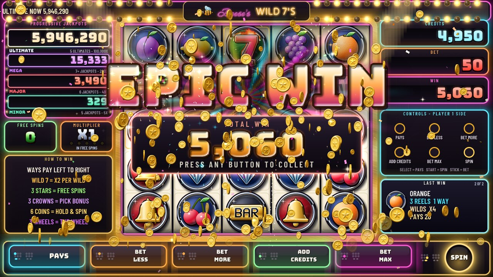

- **5 x 5 adjacent ways**: wins read left to right, one symbol per reel,
  straight across or one row up or down - every path pays
- **WILD 7** stands in for anything and **doubles every win it joins**
- **Six features**: FREE SPINS with a climbing X5 multiplier, LUCKY 7
  PICK, HOLD & SPIN, the WHEEL OF 7'S, the 7 STRIKE wild storm, and a card
  GAMBLE
- **Four progressive jackpots** that scale with your bet, up to the
  ULTIMATE at 100,000 x bet
- **Hollywood presentation**: BIG / SUPER / MEGA / EPIC win count-ups,
  1,000-particle 3-D coin showers, lightning, fireworks, a live neon marquee
- **A lounge look**: dark glass panels with neon edges, gold numerals and
  real type (Bungee, Barlow Condensed, Tilt Neon), crisp at 1280x720
- **Labelled for an unlabelled panel**: every on-screen prompt names the
  deck button and shows where it is on the panel, a CONTROLS page lights
  whatever you press, and LEARN PANEL maps any wiring on first start
- **Stereo synthesised sound**: music that follows the game, reverb,
  jackpot fanfares - no samples
- **Built for a Raspberry Pi 4**: 1280x720 at 60 fps from a software
  renderer spread across three cores

---

## Screenshots

| | |
|---|---|
| 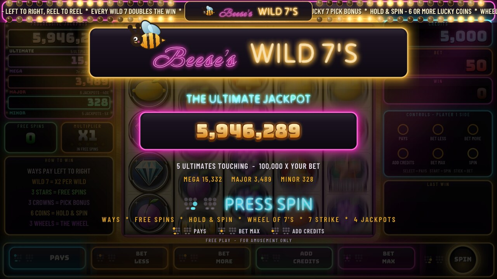 | 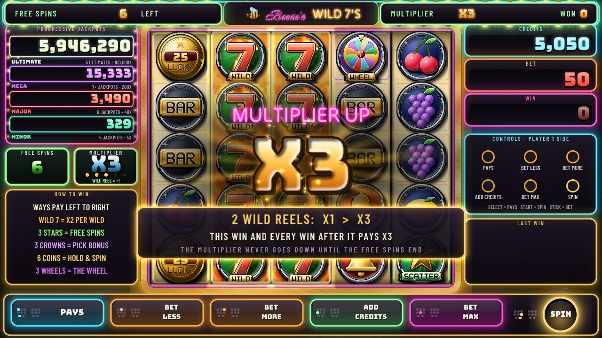 |
| **Attract loop** - the neon sign, the jackpots and the features, between players | **Free spins** - every wild reel adds +1 to the multiplier, and it never goes down until the feature ends |
| 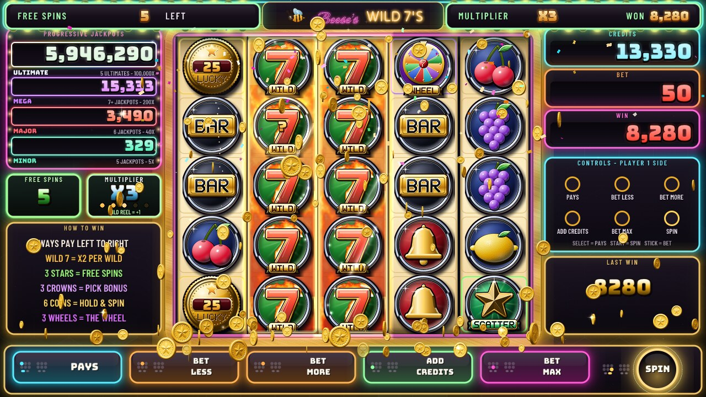 | 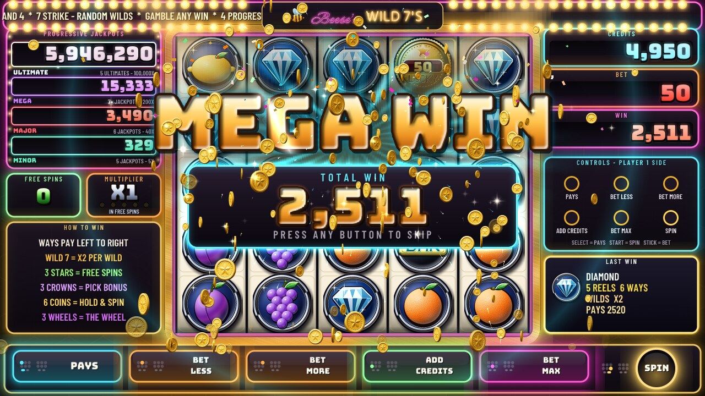 |
| **The win, spelled out** - LAST WIN shows the ways, the wild boost and the multiplier | **MEGA WIN** - the count climbs and slams up a tier at 10x, 25x, 50x and 100x |
| 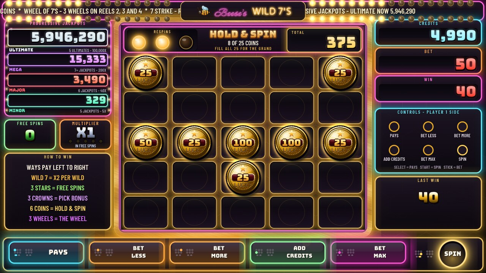 | 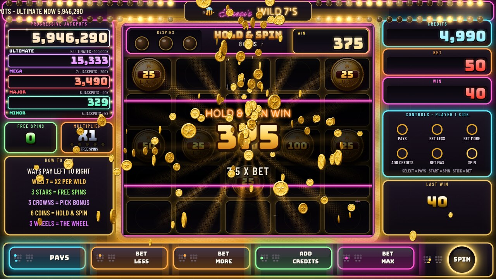 |
| **HOLD & SPIN** - six lucky coins lock; every new coin resets the respins | **The collect** - fill all 25 cells for the GRAND |
| 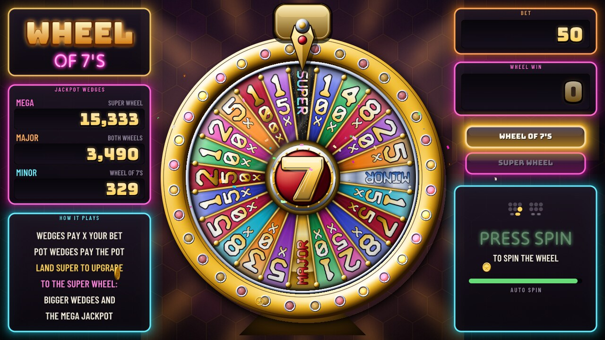 | 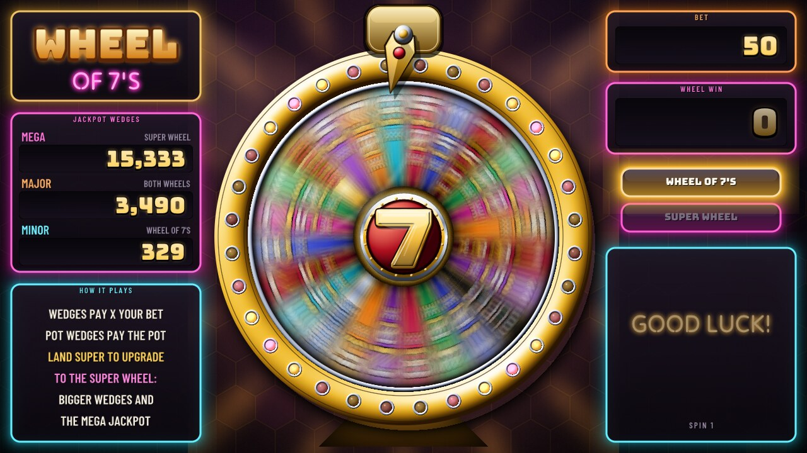 |
| **WHEEL OF 7'S** - 24 wedges, jackpots, and a SUPER WHEEL upgrade | **Spinning** - motion-blurred, with a clacking pointer and a slow crawl at the end |
| 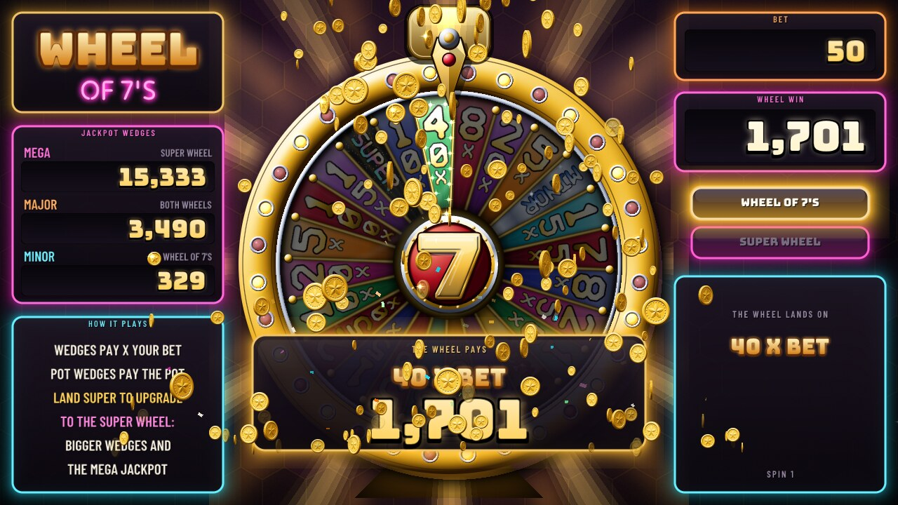 | 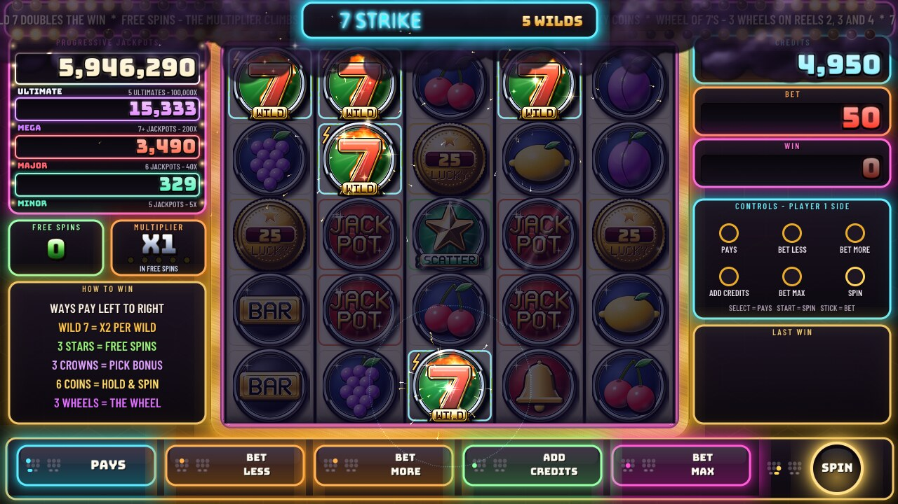 |
| **The prize** | **7 STRIKE** - a random storm; every bolt turns a cell wild |
| 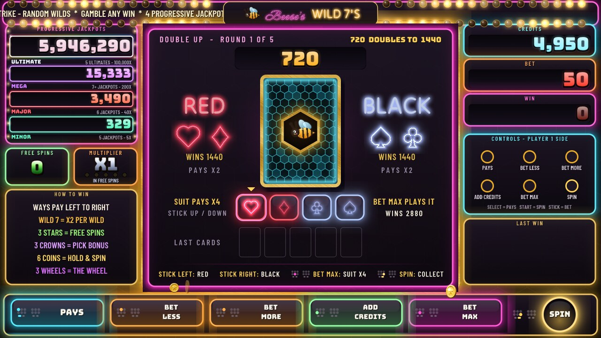 | 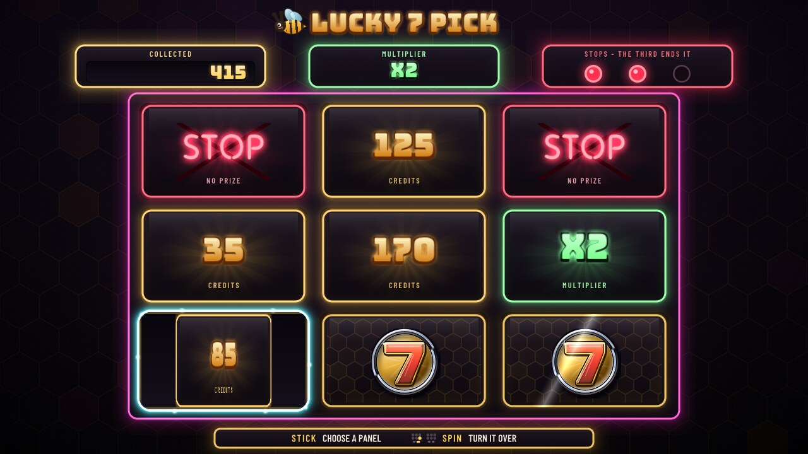 |
| **GAMBLE** - red or black to double, a suit to quadruple | **LUCKY 7 PICK** - turn panels until the third STOP |
| 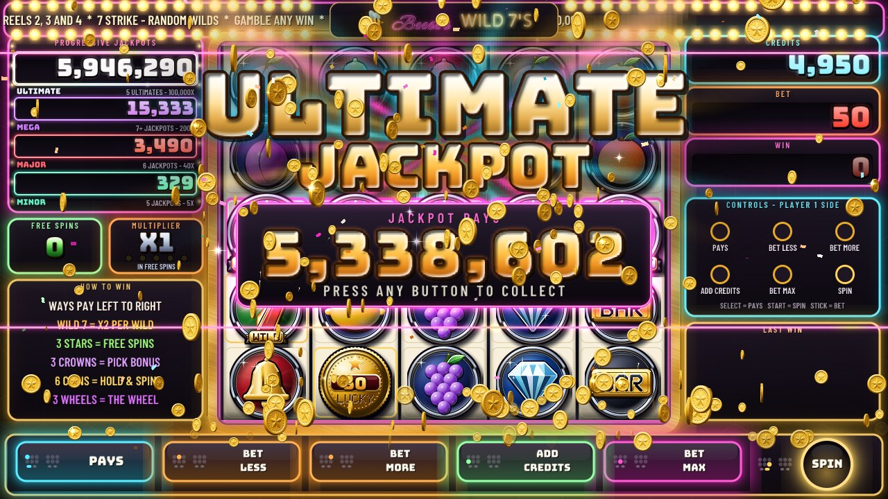 | 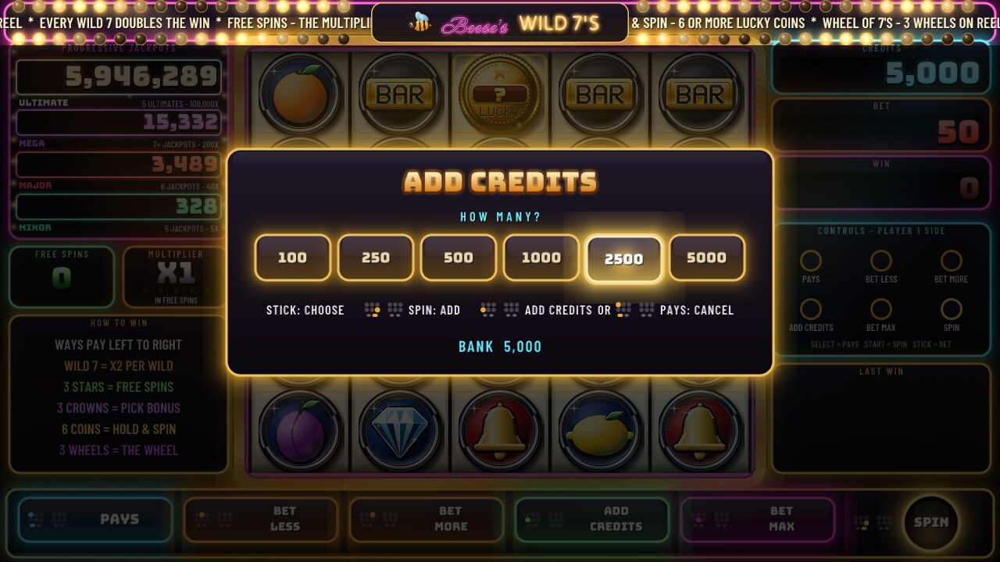 |
| **The ULTIMATE** - five ULTIMATE symbols in a chain | **ADD CREDITS** - free play; every prompt names the deck button and shows where it is |
| 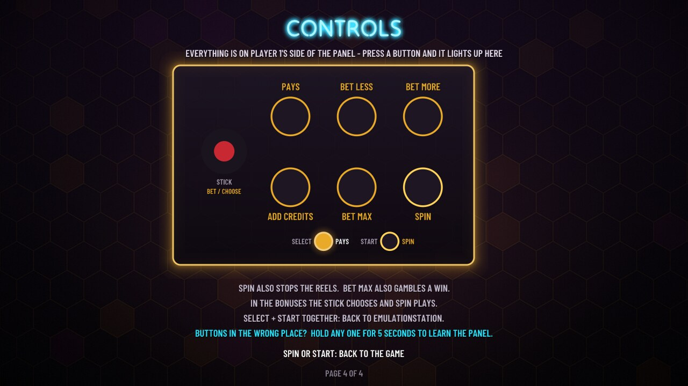 | |
| **CONTROLS** - the pay table's last page draws the panel and lights what you press | |

*Screenshots are the core's own 1280x720 output, captured headlessly with
`tools/w7shot`; the cabinet shows the same pixels, with no shader.*

---

## How it plays

A win is a chain of the same symbol starting on reel 1 and stepping one
reel to the right at a time, staying level or moving one row up or down.
Three, four or five reels pay, and where a reel offers more than one
connecting symbol every path is its own way. Each **WILD 7** on a way
doubles it.

| Feature | Starts with | What happens |
|---|---|---|
| **FREE SPINS** | 3+ SCATTER stars | 6 spins; a wild on reel 2, 3 or 4 fills its reel and adds +1 to a multiplier that climbs to **X5** and never drops during the feature |
| **LUCKY 7 PICK** | 3 CROWNS | nine panels: credits, an X2, and three STOPs |
| **HOLD & SPIN** | 6+ LUCKY COINS | coins lock, three respins reset by every new coin; coins can carry the MINOR or MAJOR jackpot; a full board wins the GRAND |
| **WHEEL OF 7'S** | a WHEEL on reels 2, 3 and 4 | 5x to 250x the bet, jackpot wedges, and a SUPER WHEEL up to the MEGA |
| **7 STRIKE** | at random, 1 spin in 100 | 3 to 8 lightning bolts turn cells into WILD 7s |
| **GAMBLE** | BET MAX on any base-game win up to 50x | red/black doubles, a suit quadruples - an exactly fair draw |
| **Jackpots** | JACKPOT clusters of 5 / 6 / 7+; five ULTIMATEs | MINOR 5x, MAJOR 40x, MEGA 200x, ULTIMATE 100,000x the bet, plus everything fed in |

The full rules, every multiplier and exactly when it goes up and comes
back down, and the odds are in the **[player's guide](docs/GAME_GUIDE.md)**.

| | |
|---|---|
| Return to player | **93.9%**, identical at every bet from 10 to 100,000 |
| A win of some kind | 1 spin in 4 |
| Free spins / Hold & Spin / Pick / Wheel | 1 in 210 / 246 / 262 / 386 spins |
| ULTIMATE jackpot | 1 in 7.9 million spins |

Every figure comes from `src/sim.c`, which compiles the game's own source
and plays it for millions of spins - the maths it measures is the code that
ships, not a copy of it.

## Controls

Everything is on player 1's side of the panel - a stick, two rows of three
buttons, SELECT and START - laid out by position the way a slot machine's
deck reads:

```
            PLAYER 1 SIDE
    (o)    [ PAYS ]        [ BET LESS ]   [ BET MORE ]
   stick   [ ADD CREDITS ] [ BET MAX ]    [ SPIN ]
           SELECT = PAYS                  START = SPIN
```

| Button | Does |
|---|---|
| SPIN (or START) | Spin; during a spin, slam the reels down. Picks, spins the wheel, collects |
| BET LESS / BET MORE, or the stick | Bet less / more. The stick also moves in the pick bonus and calls red or black in the gamble |
| BET MAX | The highest bet your credits cover, and spin - or, on a win, **GAMBLE** it |
| ADD CREDITS | Add free-play credits |
| PAYS (or SELECT) | The pay table: PAY TABLE, FEATURES, MORE FEATURES, CONTROLS |
| SELECT + START | Back to EmulationStation |

The game never names a RetroPad letter: the panel is unlabelled, so every
prompt names the deck button and draws a small map of the panel with that
button lit. The **CONTROLS** page (the pay table's fourth) lights up
whatever you press.

**LEARN PANEL.** Which encoder input lands in which position depends on
how the cabinet was wired, so on its first start the game asks for each of
the eight positions in turn ("PLAYER 1 SIDE: PRESS THE TOP LEFT BUTTON")
and saves the answer to `wild7_panel.cfg` in RetroArch's save directory.
Nobody there? It gives up after 12 seconds and doesn't ask again. To run
it later, open CONTROLS and hold any button for 5 seconds. Until it has
learned, the game assumes RetroPie's usual 6-button layout. The full
details are in the [player's guide](docs/GAME_GUIDE.md#2-controls).

---

## Install on RetroPie

On the Pi:

```sh
git clone https://github.com/cael-beese/wild-7s.git
cd wild-7s
make                          # ~3.5 minutes on a Pi 4 (one big -O3 unit)
sudo bash ./install-retropie.sh
```

Restart EmulationStation and it is under **Ports**. The installer puts the
core in `/opt/retropie/libretrocores/lr-wild7/`, writes a port config
(core-provided 16:9 aspect, no shader) and a `wild7.w7` settings file
beside the launcher. For the old CRT curve, install with
`sudo WILD7_CRT=1 bash ./install-retropie.sh` (uses `zfast_crt_curve`).

It is a standard libretro core, so it also runs on any libretro frontend:
`make` on Linux x86-64 builds `wild7_libretro.so` for desktop RetroArch, and
`make android` cross-builds for Android with the NDK. Options (sound, music,
turbo spin, flash limiter, render threads) are in RetroArch's Quick Menu ->
Core Options.

## Under the hood

- **One C translation unit, no dependencies** beyond libm and pthreads.
  The core (`src/wild7_libretro.c`) includes its feature modules
  (`src/w7_*.c`): hold & spin, the wheel, 7 STRIKE and the gamble, the
  effects system, the synth and the thread pool.
- **All art is procedural.** Every symbol, coin, card and wheel face is
  vector art drawn at start-up on a 4x supersampled canvas, lit, contoured
  and shadowed, then blitted at run time. There are no image files; the
  type is four open-licensed fonts compiled into the core and rasterised
  with stb_truetype at start-up.
- **Band-parallel software renderer.** Each frame is cut into nine
  horizontal bands drawn by three threads, leaving a core free for
  RetroArch. `tools/bandcheck.sh` proves the threaded output is
  bit-identical to single-threaded rendering. On a Pi 4: 6.6 ms a frame on
  average, peak 56 C, never throttled.
- **A small synthesiser**: band-limited oscillators, FM bells, plucked
  strings, a stereo hall reverb, a limiter, and a sequencer whose tracks
  change with the game state.
- **Test harness**: `make shot` builds `w7shot`, a headless host that runs
  the real `retro_run()` loop and writes PNG frames, WAV audio, frame hashes
  and timings; `WILD7_FORCE=hold|wheel|storm|epic|...` lands any feature on
  genuine reel stops.

```sh
make && make sim shot          # the core, the simulator, the frame dumper
./w7sim 5000000 0              # five million spins at bet 10
WILD7_FORCE=wheel WILD7_AUTOPILOT=3 ./w7shot -n 1500 -s every:60 -o out
```

## Documentation

| | |
|---|---|
| [docs/GAME_GUIDE.md](docs/GAME_GUIDE.md) | the player's guide: every feature, every multiplier, the jackpots, the odds |
| [docs/ARCHITECTURE.md](docs/ARCHITECTURE.md) | how the code works: state machine, reels and evaluation, modules, renderer, audio, the maths |
| [docs/OPERATIONS.md](docs/OPERATIONS.md) | running it on the cabinet: build, deploy, launch, soak testing, backups |
| [docs/DESIGN.md](docs/DESIGN.md) | the design notes and the history of how the game got here |
| [DEVELOPING.md](DEVELOPING.md) | the rules for changing it: frame budget and the render contract |

WILD 7's is a game of chance played for free play credits on a home
cabinet; there is no real money in it.

## License

**Source-available, free for noncommercial use.** WILD 7's is licensed
under the [PolyForm Noncommercial License 1.0.0](LICENSE.md): you may use,
study, modify and share it for personal, hobby, educational and other
noncommercial purposes.

**Any commercial use, in whole or in part, requires written permission**
from the copyright holder - including selling it or anything built from
it, or running it in a cabinet, product or service operated for profit. To
ask, open an issue on this repository.

Third-party parts keep their own licenses (details in
[LICENSE.md](LICENSE.md)): `src/libretro.h`, the standard libretro API
header from [libretro-common](https://github.com/libretro/libretro-common),
is the RetroArch team's under MIT; `src/third_party/stb_truetype.h` is
Sean Barrett's, public domain or MIT; and the fonts in `assets/fonts/`
(Barlow Condensed, Bungee, Tilt Neon, Neonderthaw) are under the SIL Open
Font License 1.1, with their notices beside them.
